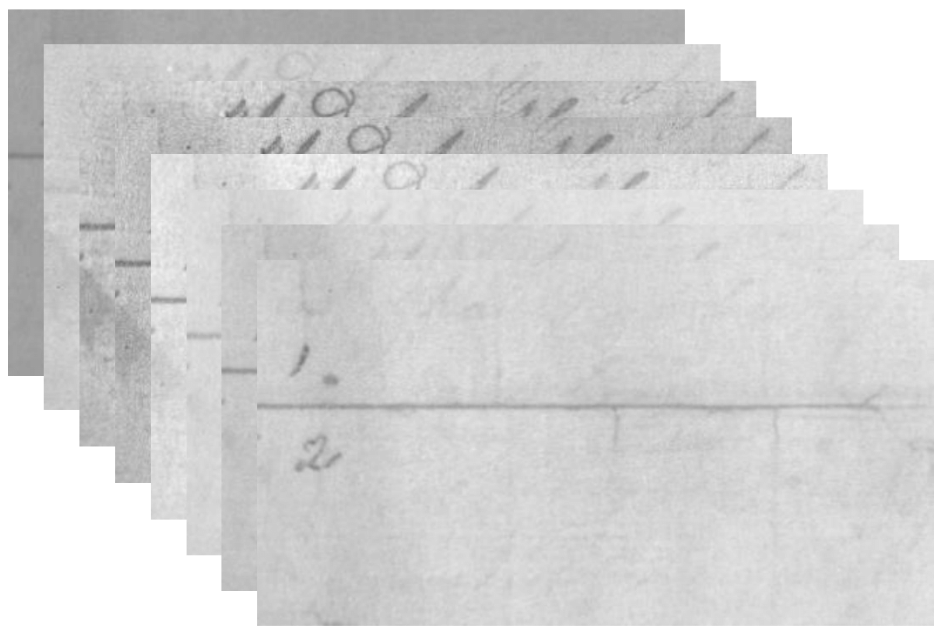

## Overview

Ancient multispectral document images present a challenging source separation problem: handwritten ink layers from different eras are visually entangled with paper texture, degradation artefacts, and background noise. Standard approaches fail because the spectral mixing is non-linear and the sources are highly correlated.

## Approach

I designed **Attention–NMF**, a hybrid architecture that combines:

1. **CNN attention encoder** — learns spatial and spectral attention maps to weight informative pixel-band combinations
2. **NMF decoder** — decomposes the attended representation into non-negative spectral components (interpretable basis vectors)
3. **Linear independence constraint** — a regularisation term that encourages NMF basis vectors to be linearly independent, reducing source confusion and improving separation quality

The model is trained end-to-end with a reconstruction objective plus the independence regulariser.

## Results

- Outperformed state-of-the-art NMF baselines and CNN-only approaches on handwritten text extraction benchmarks
- Reduced model parameters compared to baseline architectures while improving source separation quality
- Improved handling of nonlinear spectral mixing in degraded multispectral documents
- Enhanced interpretability through explicit NMF basis decomposition

## Publication

Work submitted to **ICASSP 2025** (IEEE International Conference on Acoustics, Speech and Signal Processing).

> Code available. Research paper in publication — public repository link to be added post-publication.
